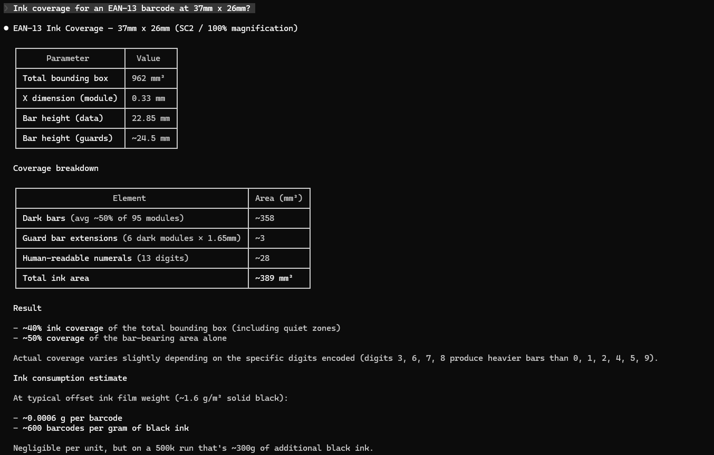

<div align="center">

# mcp-print

**Professional print & color workflow tools for AI assistants**

[](https://pypi.org/project/mcp-print/)
[](https://pypi.org/project/mcp-print/)
[](https://opensource.org/licenses/MIT)
[](https://github.com/kcgdz/mcp-print/actions/workflows/ci.yml)

2400+ Pantone colors &bull; CMYK/RGB conversion &bull; Ink & cost estimation &bull; ICC profiles &bull; Spot color separation &bull; Barcode coverage &bull; Delta E &bull; Paper weights

**Works 100% offline &mdash; no API keys needed**

[Install](#install) &bull; [Configure](#configure-with-claude-code) &bull; [Tools](#tools) &bull; [Examples](#usage-examples) &bull; [Contributing](#development)

</div>

---

## Who is this for?

| Role | Use case |
|---|---|
| **Print designers** | Check Pantone-to-CMYK conversions without leaving your editor |
| **Prepress engineers** | Estimate ink costs, verify color accuracy (Delta E), analyze ICC profiles |
| **Packaging teams** | Convert paper weights, separate spot vs process colors, cost entire print runs |
| **Brand managers** | Find the closest Pantone match to any HEX color |

## Install

```bash
pip install mcp-print
```

> Requires Python 3.10+. Zero external dependencies beyond the [MCP SDK](https://pypi.org/project/mcp/).

## Configure with Claude Code

Add to your Claude Code MCP config (`~/.claude/settings.json` or project `.mcp.json`):

```json
{
  "mcpServers": {
    "print": {
      "command": "python",
      "args": ["-m", "mcp_print"]
    }
  }
}
```

Restart Claude Code — all ten tools will be available immediately.

## Tools

### Color & Pantone

| Tool | Description |
|---|---|
| `pantone_to_cmyk_tool` | Convert a Pantone name to CMYK + HEX. Fuzzy matching — `"485C"`, `"pantone 485"`, `"Warm Red"` all work |
| `pantone_search_tool` | Find the closest Pantone colors to any HEX or CMYK value (top N matches by Delta E) |
| `cmyk_to_rgb_tool` | Convert CMYK values (0-100) to RGB (0-255) + HEX |
| `color_delta_e_tool` | Calculate Delta E (CIE76) between two CMYK colors with quality interpretation |
| `spot_color_separator_tool` | Given a list of design colors, recommend which should be spot vs process |

### Print Production

| Tool | Description |
|---|---|
| `ink_consumption_tool` | Estimate ink grams/kg and cost for a print run (offset, flexo, gravure, screen, digital) |
| `print_cost_estimator_tool` | Full job cost breakdown: ink + plates + makeready + run cost |
| `barcode_ink_coverage_tool` | Ink coverage % for Code 128, EAN-13, QR, and Data Matrix barcodes |

### Utilities

| Tool | Description |
|---|---|
| `icc_profile_info_tool` | Parse ICC/ICM profile metadata (color space, device class, version, PCS) from any `.icc` file |
| `paper_weight_converter_tool` | Convert between GSM, lb text, and lb cover |

## Usage Examples

Once configured, just ask Claude naturally:

---

### Pantone Lookup

> *"What's the CMYK breakdown for Pantone 485 C?"*

Fuzzy matching accepts any format: `"485C"`, `"pantone 485"`, `"485 coated"`, `"Warm Red"`

```json
{ "name": "Pantone 485 C", "c": 0, "m": 95, "y": 100, "k": 0, "hex": "#FF0D0D" }
```


---

### Reverse Pantone Search

> *"What Pantone colors are closest to #DA291C?"*

```json
{
  "matches": [
    { "name": "Pantone 485 C", "c": 0, "m": 95, "y": 100, "k": 0, "hex": "#FF0D0D" },
    { "name": "Pantone 485 M", "c": 1, "m": 93, "y": 99, "k": 2, "hex": "#FA0E03" }
  ],
  "search_type": "hex #DA291C"
}
```

---

### Color Conversion

> *"Convert CMYK 100/44/0/0 to RGB"*

```json
{ "r": 0, "g": 143, "b": 255, "hex": "#008FFF" }
```

---

### Ink Estimation

> *"How much ink for 10,000 A4 flyers at 35% coverage on offset?"*

```json
{ "ink_grams": 327.44, "ink_kg": 0.3274, "cost_estimate_usd": 8.19 }
```

---

### Full Print Job Costing

> *"Cost estimate: 5,000 A4 flyers, 4-color offset, 120gsm, double-sided"*

```json
{
  "total_cost_usd": 628.14,
  "cost_per_unit_usd": 0.1256,
  "breakdown": {
    "ink": 11.34,
    "plates": 280.00,
    "makeready": 200.00,
    "run_cost": 136.80
  }
}
```

---

### Color Matching QC

> *"Compare brand blue (100/72/0/18) vs proof (98/70/2/20) — is the Delta E acceptable?"*

```json
{ "delta_e": 3.41, "interpretation": "fair — noticeable difference" }
```

| Delta E | Quality |
|---|---|
| < 1 | Excellent — imperceptible |
| 1 - 3 | Good — barely perceptible |
| 3 - 6 | Fair — noticeable |
| > 6 | Poor — obvious difference |

---

### Spot vs Process Recommendation

> *"Should these colors be spot or process?"*

```json
{
  "spot_colors": [
    { "nearest_pantone": "Pantone 485 C", "delta_e": 0.0, "reason": "Close match — use spot for accuracy" }
  ],
  "process_colors": [
    { "nearest_pantone": "Pantone 375 C", "delta_e": 8.2, "reason": "No close match — reproduce as CMYK" }
  ]
}
```

---

### ICC Profile Inspection

> *"What color space does this ICC profile use?"*

```json
{
  "profile_name": "ISOcoated_v2",
  "color_space": "CMYK",
  "device_class": "Output (Printer)",
  "version": "2.4.0",
  "pcs": "XYZ"
}
```

---

### Barcode Ink Coverage

> *"Ink coverage for an EAN-13 barcode at 37mm x 26mm?"*

```json
{
  "coverage_percent": 52.0,
  "recommended_ink": "Process Black (K: 100)",
  "print_method_suggestion": "offset — good resolution for medium modules"
}
```



---

### Paper Weight Conversion

> *"What's 80 lb text in GSM?"*

```json
{ "value": 118.42, "from_unit": "lb_text", "to_unit": "gsm" }
```

## Pantone Database

The built-in database contains **2,415 Pantone colors**:

| Series | Range | Description |
|---|---|---|
| Numeric | 100–699 | Yellows, oranges, reds, pinks, purples, blues, greens, grays, browns |
| 7000 series | 7400–7547 | Extended gamut colors |
| Named | — | Black, White, Warm Red, Reflex Blue, Process Blue, Cool/Warm Grays 1–11, Hexachrome series |

Every color is available in three finishes: **Coated (C)**, **Uncoated (U)**, and **Matte (M)**.

Fuzzy matching handles format variations — `"485C"`, `"pantone 485"`, `"485 coated"` all resolve correctly.

## Development

```bash
git clone https://github.com/kcgdz/mcp-print.git
cd mcp-print
pip install -e .
pip install pytest
pytest tests/ -v
```

```
65 passed in 0.15s
```

## License

MIT
