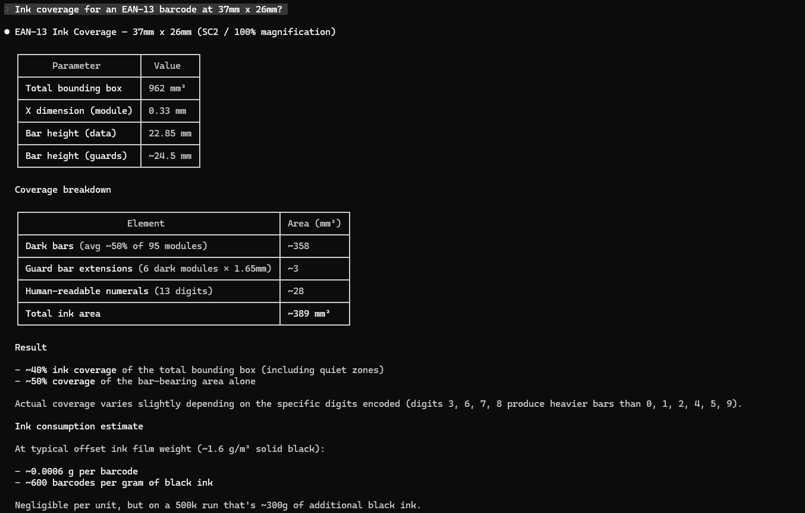

<div align="center">

# mcp-print

**Professional print & color workflow tools for AI assistants**

[](https://pypi.org/project/mcp-print/)
[](https://pypi.org/project/mcp-print/)
[](https://opensource.org/licenses/MIT)
[](https://github.com/kcgdz/mcp-print/actions/workflows/ci.yml)

CMYK/RGB conversion &bull; Ink & cost estimation &bull; ICC profiles &bull; Spot color separation &bull; Barcode coverage &bull; Delta E &bull; Paper weights &bull; Preflight checks &bull; Substrate simulation &bull; Imposition &bull; Booklet & spine calculation &bull; Lab conversion &bull; CIEDE2000 &bull; TAC/GCR &bull; Dot gain compensation &bull; PDF preflight &bull; Job quoting &bull; Your own local color palette

**Works 100% offline &mdash; no API keys needed &mdash; no bundled color library**

[Install](#install) &bull; [Configure](#configure-with-claude-code) &bull; [Local palette](#local-color-palette) &bull; [Tools](#tools) &bull; [Examples](#usage-examples) &bull; [Contributing](#development)

Backed by [optiraj.com](https://optiraj.com) — SaaS for print professionals

</div>

---

## Who is this for?

| Role | Use case |
|---|---|
| **Print designers** | Convert between CMYK, RGB, HEX, and Lab without leaving your editor |
| **Prepress engineers** | Estimate ink costs, verify color accuracy (Delta E), analyze ICC profiles, run preflight checks |
| **Packaging teams** | Convert paper weights, separate spot vs process colors, cost entire print runs, simulate substrate shifts |
| **Brand managers** | Find the closest entry in your own color palette to any HEX or CMYK value |

## Install

```bash
pip install mcp-print
```

> Requires Python 3.10+. Zero external dependencies beyond the [MCP SDK](https://pypi.org/project/mcp/).

## Configure with Claude Code

Add to your Claude Code MCP config (`~/.claude/settings.json` or project `.mcp.json`):

```json
{
  "mcpServers": {
    "print": {
      "command": "python",
      "args": ["-m", "mcp_print"]
    }
  }
}
```

Restart Claude Code — all twenty tools will be available immediately. Palette tools additionally need a [local palette file](#local-color-palette); without one they return an error and every other tool keeps working.

## Local color palette

mcp-print **does not ship or download any color library.** `palette_lookup_tool`, `palette_search_tool`, and `spot_color_separator_tool` work on a JSON file that you provide and point to explicitly:

```json
{
  "mcpServers": {
    "print": {
      "command": "python",
      "args": ["-m", "mcp_print"],
      "env": { "MCP_PRINT_PALETTE_PATH": "/home/me/.config/mcp-print/studio.palette.json" }
    }
  }
}
```

Use an absolute path (relative paths resolve against the server's working directory; `~` is expanded). The file is re-read automatically when it changes.

### Schema

```json
{
  "palette": "Example synthetic palette",
  "colors": [
    { "name": "Harbor Blue", "c": 88, "m": 42, "y": 8,  "k": 4 },
    { "name": "Moss Green",  "c": 55, "m": 15, "y": 85, "k": 20 },
    { "name": "Clay Orange", "c": 5,  "m": 60, "y": 85, "k": 5 }
  ]
}
```

| Field | Rules |
|---|---|
| `palette` | Optional label, echoed in results |
| `colors` | Required, non-empty list |
| `colors[].name` | Required, non-empty string (max 200 chars), unique ignoring case and repeated whitespace |
| `colors[].c/m/y/k` | Required JSON numbers from 0 to 100. Booleans, strings, `NaN`, `Infinity`, and out-of-range values are rejected |

Other fields are rejected rather than silently ignored. The file must be UTF-8 (a BOM is accepted) and at most 10 MB. A synthetic sample lives in [`examples/example-palette.json`](examples/example-palette.json).

### Behavior and limits

- **No palette configured, missing file, invalid JSON, empty list, or invalid entry** → the palette tools return an `error` explaining what to fix (entry index and field, without echoing your values). The server still starts and all other tools work.
- **Names are used exactly as you wrote them.** Lookup ignores case and extra whitespace only; no brand prefixes or finish suffixes are added or guessed. Close names are returned as `suggestions`, never as a match.
- **Distances are approximate.** CMYK is converted to sRGB and Lab with simple formulas and no ICC profile, then compared with CIEDE2000. Results indicate similarity *within your palette* — they are not official catalog values, not a measure of print accuracy, and not a guarantee of how a color will print.
- **Your palette stays local.** It is read only from the path you configure, never logged, bundled, uploaded, or exposed as an MCP resource. `*.palette.json` files and `palettes/` directories are git-ignored in this repo; keep palette files outside the project anyway.
- **Rights are yours to check.** Palette files are subject to their own terms of use. Pointing mcp-print at a file does not make its use licensed or appropriate; make sure you are entitled to use the data you load.

## Tools

### Color & Palette

| Tool | Description |
|---|---|
| `palette_lookup_tool` | Look up a color by name in your [local palette](#local-color-palette) (case/whitespace-insensitive, names kept as written) |
| `palette_search_tool` | Find the closest entries in your local palette to a HEX or CMYK value (approximate CIEDE2000) |
| `cmyk_to_rgb_tool` | Convert CMYK values (0-100) to RGB (0-255) + HEX |
| `rgb_to_cmyk_tool` | Convert RGB (0-255) or HEX to CMYK values (0-100) |
| `color_delta_e_tool` | Calculate Delta E (CIEDE2000 or CIE76) between two CMYK colors with quality interpretation |
| `lab_convert_tool` | Convert between CIELAB (spectrophotometer readings), CMYK, RGB, and HEX |
| `spot_color_separator_tool` | Report how close each design color is to your local palette (within/beyond a Delta E threshold) — a similarity report, not a spot-vs-process decision |

### Print Production

| Tool | Description |
|---|---|
| `ink_consumption_tool` | Estimate ink grams/kg and cost for a print run (offset, flexo, gravure, screen, digital) |
| `print_cost_estimator_tool` | Full job cost breakdown: ink + plates + makeready + run cost |
| `barcode_ink_coverage_tool` | Ink coverage % for Code 128, EAN-13, QR, and Data Matrix barcodes |
| `preflight_check_tool` | Pre-press file validation — checks color mode, resolution, bleed, fonts, ink coverage, and transparency |
| `substrate_simulator_tool` | Simulate CMYK color shifts on different paper substrates (dot gain, absorption, tint) |
| `imposition_calculator_tool` | N-up imposition — how many pieces fit on a press sheet, sheets needed, utilization % |
| `booklet_calculator_tool` | Signature count, page rounding, and spine thickness for saddle-stitch or perfect-bound booklets |
| `dot_gain_compensation_tool` | File CMYK values that hit target tints on press — inverse of substrate simulation |
| `ink_limit_check_tool` | Total ink coverage (TAC) check with automatic GCR reduction |
| `full_job_quote_tool` | Imposition + sheet-based costing in one call, with local prices in any currency |
| `pdf_preflight_tool` | Preflight a real PDF file: trim/bleed boxes, font embedding, image color spaces (`pip install mcp-print[pdf]`) |

### Utilities

| Tool | Description |
|---|---|
| `icc_profile_info_tool` | Parse ICC/ICM profile metadata (color space, device class, version, PCS) from any `.icc` file |
| `paper_weight_converter_tool` | Convert between GSM, lb text, and lb cover |

## Usage Examples

Once configured, just ask Claude naturally:

---

### Palette Lookup

> *"What are the CMYK values of Harbor Blue in my palette?"*

With [`examples/example-palette.json`](examples/example-palette.json) configured:

```json
{
  "color": { "name": "Harbor Blue", "c": 88, "m": 42, "y": 8, "k": 4, "hex": "#1D8EE1" },
  "source": "user_palette",
  "palette": "Example synthetic palette",
  "note": "Values come from your local palette file. ..."
}
```

Without a configured palette the tool returns `{"error": "No color palette configured. Set MCP_PRINT_PALETTE_PATH ..."}`.

---

### Palette Search

> *"Which of my palette colors are closest to #2A8FD8?"*

```json
{
  "matches": [
    { "name": "Harbor Blue", "c": 88, "m": 42, "y": 8, "k": 4, "hex": "#1D8EE1", "delta_e": 1.12 },
    { "name": "Charcoal", "c": 60, "m": 50, "y": 45, "k": 75, "hex": "#1A2023", "delta_e": 41.77 }
  ],
  "search_type": "hex #2A8FD8",
  "delta_e_method": "ciede2000",
  "source": "user_palette",
  "palette": "Example synthetic palette"
}
```

---

### Color Conversion

> *"Convert CMYK 100/44/0/0 to RGB"*

```json
{ "r": 0, "g": 143, "b": 255, "hex": "#008FFF" }
```

---

### Ink Estimation

> *"How much ink for 10,000 A4 flyers at 35% coverage on offset?"*

```json
{ "ink_grams": 327.44, "ink_kg": 0.3274, "cost_estimate_usd": 8.19 }
```

---

### Full Print Job Costing

> *"Cost estimate: 5,000 A4 flyers, 4-color offset, 120gsm, double-sided"*

```json
{
  "total_cost": 628.14,
  "cost_per_unit": 0.1256,
  "currency": "USD",
  "breakdown": {
    "ink": 11.34,
    "plates": 280.00,
    "makeready": 200.00,
    "run_cost": 136.80,
    "paper": 0.0
  }
}
```

Prices default to USD industry averages — pass your own ink/plate/makeready/run/paper prices in any currency for a localized quote.

---

### Color Matching QC

> *"Compare brand blue (100/72/0/18) vs proof (98/70/2/20) — is the Delta E acceptable?"*

```json
{ "delta_e": 3.41, "interpretation": "fair — noticeable difference" }
```

| Delta E | Quality |
|---|---|
| < 1 | Excellent — imperceptible |
| 1 - 3 | Good — barely perceptible |
| 3 - 6 | Fair — noticeable |
| > 6 | Poor — obvious difference |

---

### Palette Proximity (spot color separator)

> *"How close are these design colors to my palette?"*

```json
{
  "within_threshold": [
    { "color": { "c": 86, "m": 40, "y": 10, "k": 5 }, "hex": "#2291DA",
      "nearest_palette_color": "Harbor Blue", "nearest_palette_cmyk": { "c": 88, "m": 42, "y": 8, "k": 4 }, "delta_e": 1.79 }
  ],
  "beyond_threshold": [
    { "color": { "c": 0, "m": 100, "y": 0, "k": 0 }, "hex": "#FF00FF",
      "nearest_palette_color": "Charcoal", "nearest_palette_cmyk": { "c": 60, "m": 50, "y": 45, "k": 75 }, "delta_e": 44.4 }
  ],
  "threshold": 5.0,
  "delta_e_method": "ciede2000",
  "summary": "Compared 2 colors with 5 palette entries (Delta E ciede2000, threshold 5.0): 1 within threshold, 1 beyond."
}
```

Being close to a palette color does not by itself mean a spot ink would be more accurate or more suitable — that depends on ink availability, press setup, substrate, cost, brand requirements, and measured proofs.

---

### ICC Profile Inspection

> *"What color space does this ICC profile use?"*

```json
{
  "profile_name": "ISOcoated_v2",
  "color_space": "CMYK",
  "device_class": "Output (Printer)",
  "version": "2.4.0",
  "pcs": "XYZ"
}
```

---

### Barcode Ink Coverage

> *"Ink coverage for an EAN-13 barcode at 37mm x 26mm?"*

```json
{
  "coverage_percent": 52.0,
  "recommended_ink": "Process Black (K: 100)",
  "print_method_suggestion": "offset — good resolution for medium modules"
}
```



---

### Paper Weight Conversion

> *"What's 80 lb text in GSM?"*

```json
{ "value": 118.42, "from_unit": "lb_text", "to_unit": "gsm" }
```

---

### Preflight Check

> *"Validate my file for offset printing: CMYK, 300 DPI, 3mm bleed, fonts embedded"*

```json
{
  "status": "pass",
  "checks": [
    { "name": "color_mode", "status": "pass", "message": "CMYK is correct for offset." },
    { "name": "resolution", "status": "pass", "message": "300 DPI meets the minimum of 300 DPI for offset." },
    { "name": "bleed", "status": "pass", "message": "3.0 mm bleed meets the 3.0 mm minimum for offset." },
    { "name": "fonts", "status": "pass", "message": "All fonts are embedded." },
    { "name": "ink_coverage", "status": "pass", "message": "Total ink coverage 280% is within safe limits." },
    { "name": "transparency", "status": "pass", "message": "No transparency detected." }
  ],
  "summary": "6 passed, 0 warnings, 0 failed out of 6 checks.",
  "recommendation": "File is ready for production."
}
```

Checks color mode, resolution, bleed, font embedding, total ink coverage, and transparency against the target print method (offset, digital, flexo, gravure, screen).

| Check | Fail | Warning |
|---|---|---|
| Color mode | RGB/spot for offset/flexo/gravure/screen | RGB for digital |
| Resolution | Below 75% of method minimum | Below method minimum |
| Bleed | No bleed | Below method minimum |
| Fonts | Not embedded | — |
| Ink coverage | > 340% | > 300% |
| Transparency | — | Present (needs flattening) |

---

### Substrate Simulation

> *"How will CMYK 50/30/20/10 look on newsprint vs glossy coated?"*

```json
{
  "original": { "c": 50, "m": 30, "y": 20, "k": 10, "hex": "#73A1B8" },
  "simulated": { "c": 57.5, "m": 38.3, "y": 29.8, "k": 31.9, "hex": "#4A6B7A" },
  "substrate": "newsprint",
  "print_method": "offset",
  "adjustments": { "dot_gain_applied": 30, "absorption_k_added": 16.2 },
  "delta_e_from_original": 21.11,
  "warning": "Severe color shift — this substrate may not be suitable for color-critical work."
}
```

Six substrate profiles with different dot gain, absorption, and paper tint characteristics:

| Substrate | Dot gain (offset) | Tint | Typical use |
|---|---|---|---|
| `glossy_coated` | 12% | None | Magazines, brochures |
| `matte_coated` | 18% | Slight warm | Art books, reports |
| `uncoated` | 22% | Warm | Letterheads, books |
| `newsprint` | 30% | Yellow/gray | Newspapers, flyers |
| `kraft` | 25% | Strong brown | Packaging, bags |
| `recycled` | 25% | Slight gray | Eco-friendly prints |

---

### Imposition (N-up)

> *"How many A4 flyers fit on a 70x100 sheet, and how many sheets for 10,000?"*

```json
{
  "ups_per_sheet": 9,
  "layout": "3 x 3",
  "orientation": "normal",
  "sheets_needed": 1112,
  "sheets_with_waste": 1168,
  "sheet_utilization_percent": 84.1
}
```

Accounts for bleed, cutting gaps, and the gripper margin; tries both piece orientations and picks the best.

---

### Booklet & Spine Calculation

> *"48-page booklet on 90gsm uncoated with a 300gsm cover — signatures and spine?"*

```json
{
  "total_pages": 48,
  "signatures": 3,
  "total_sheets": 12,
  "spine_thickness_mm": 3.24,
  "binding": "saddle_stitch",
  "binding_note": "Suitable for saddle stitching."
}
```

Rounds pages to a multiple of 4, warns when the page count doesn't suit the chosen binding (saddle stitch > 64 pages, perfect bound < 3 mm spine).

---

## Migrating from 0.5.x

The bundled Pantone table and its generator script were removed because their source and redistribution rights could not be verified. This is a **breaking change**:

| Before (≤ 0.5.x) | Now |
|---|---|
| `pantone_to_cmyk_tool(pantone_name)` | `palette_lookup_tool(name)` — exact (case/whitespace-insensitive) name from your palette; no `Pantone` prefix or `C`/`U`/`M` variants are generated |
| `pantone_search_tool(...)` | `palette_search_tool(...)` — same inputs, ranked by CIEDE2000, adds `delta_e` per match |
| `spot_color_separator_tool` → `spot_colors` / `process_colors` | `within_threshold` / `beyond_threshold` |
| `nearest_pantone` | `nearest_palette_color` (+ `nearest_palette_cmyk`) |
| `reason` / `reasoning` | `summary` + `note`; no spot/process recommendation is made |
| Resource `mcp-print://pantone-database` | Removed, with no replacement (palettes are never exposed in bulk) |
| Python: `colors.pantone_to_cmyk`, `colors.pantone_search` | `palette.palette_lookup`, `palette.palette_search` |

All palette features now require `MCP_PRINT_PALETTE_PATH`. The distance metric changed from CIE76 to CIEDE2000, so the same `threshold` groups colors differently than before. No deprecated aliases are kept.

## Development

```bash
git clone https://github.com/kcgdz/mcp-print.git
cd mcp-print
pip install -e .
pip install pytest
pytest tests/ -v
```

```
235 passed
```

## Acknowledgements

Development is supported by [Optiraj](https://optiraj.com) — a SaaS platform for print professionals. Optiraj sponsors open-source tooling that makes professional print knowledge freely accessible to the community.

## License

mcp-print's code is released under the MIT License. Color palettes you load are not part of mcp-print and remain subject to their own terms of use.
